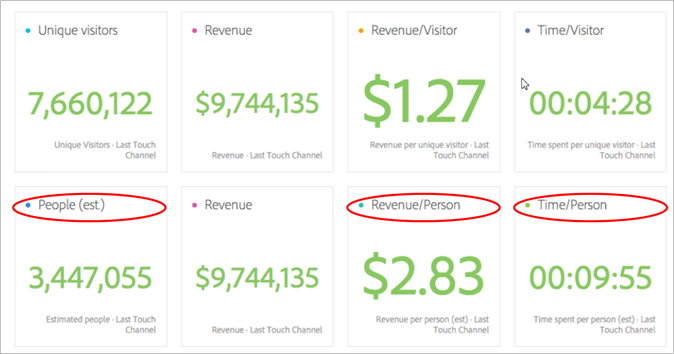
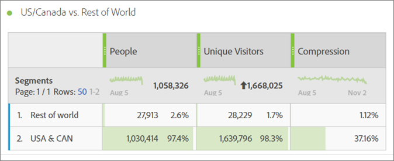
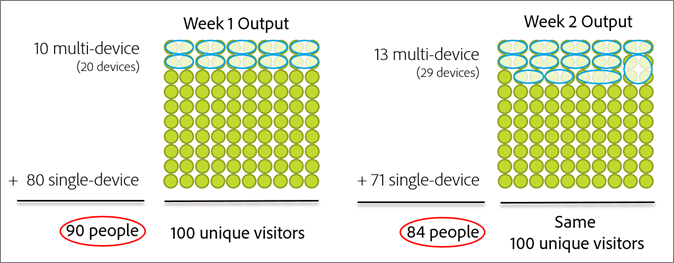
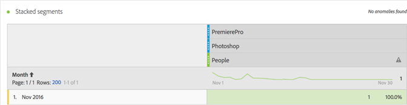
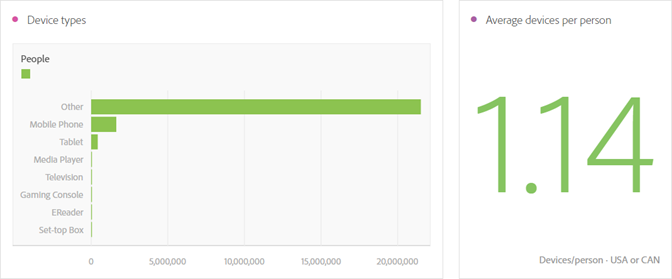
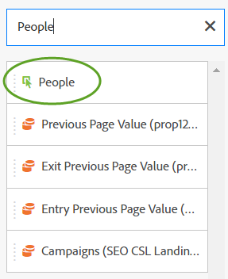

# 사람 지표{#people-metric}

사람 지표는 Adobe 장치 그래프를 기반으로 하는 사람(또는 장치 그룹)의 수입니다. 사람 지표를 적용하여 Analysis Workspace의 장치에서 방문자를 식별할 수 있습니다.

## 사람 지표 사전 요구 사항 및 고려 사항 {#section-34551d0435fb4b3cb3fad736b7961541}

<table id="table_120F7EF50042485391E58B22DD00A2A8"> 
 <thead> 
  <tr> 
   <th colname="col1" class="entry"> 사전 요구 사항 또는 고려 사항 </th> 
   <th colname="col2" class="entry"> 설명 </th> 
  </tr>
 </thead>
 <tbody> 
  <tr> 
   <td colname="col1"> 
Device Co-op 
 </td> 
   <td colname="col2"> 
 사람 지표를 사용하려면, <a href="http://landing.adobe.com/en/na/events/summit/275658-summit-co-op.html" format="html" scope="external"> Adobe Experience Cloud 장치 협력</a>그룹의 구성원이 됩니다. Co-op은 개인의 여러 장치(또는 Experience Cloud ID)를 식별합니다. Analytics는 이 정보를 활용하여 브랜드와 상호 작용하는 사람들의 수를 통계적으로 추출합니다. 지표는 5% 이내로 정확합니다. 
 
<b>지역</b>:Device Co-op은 현재 미국과 캐나다에서만 사용할 수 있습니다. 따라서 사람 지표를 평가할 때 미국과 캐나다에서만 데이터를 필터링하는 분석에 세그먼트를 적용해야 합니다. 
 
Device Graph는 매주 새로운 Co-op 버전을 계산하고 사용할 수 있도록 게시합니다. 화요일에 시스템은 최신 데이터를 수집하고 업데이트된 그래프 버전을 게시합니다. Experience Cloud 솔루션은 그래프의 최신 버전을 사용합니다. 특히 Analytics에서 변경 사항을 수요일에 읽고 변경 사항을 처리하는 데 일반적으로 1일~2일이 걸립니다. 
 
 
중요: 그래프가 매주 업데이트되면 사람 지표에 영향을 줄 수 있습니다. 즉, 그래프가 학습되고 업데이트되면 시간 경과에 따라 사람 수가 변경될 수 있습니다. 예를 들어 지난 달에 사람을 카운트하는 보고서를 오늘 실행한 다음 그래프가 업데이트된 후 1주일 내에 동일한 보고서를 실행하는 경우 내역 사람 수는 약간 변경될 수 있습니다. 
 
 </td> 
  </tr> 
  <tr> 
   <td colname="col1"> 지표 권한 </td> 
   <td colname="col2"> 
사람 지표에 대한 액세스 권한이 부여된 경우에만 사람 지표를 사용할 수 있습니다. 관리자는 관리 도구에서 지표 권한을 사용자 지정할 수<a href="https://docs.adobe.com/content/help/en/analytics/admin/user-product-management/customize-report-access/groups-metrics.html" format="html" scope="external"> 있습니다</a> . 
 </td> 
  </tr> 
  <tr> 
   <td colname="col1"> IMS 조직에 매핑 </td> 
   <td colname="col2"> 
사람 지표는 IMSORG에 매핑된 모든 보고서 세트에 대해 <a href="https://docs.adobe.com/content/help/ko-KR/core-services/interface/about-core-services/report-suite-mapping.html" format="html" scope="external"> 활성화됩니다</a>. 
 </td> 
  </tr> 
  <tr> 
   <td colname="col1"> 
분석 프로젝트/도구 
 </td> 
   <td colname="col2"> 
Analysis Workspace  , Ad Hoc Analysis , Report Builder에서  그리고 API를 통해 사람지표를 사용합니다. 계산된 지표를 포함하여 고유 방문자 수 지표를 사용할 때마다 사용할 수 있습니다. 
 
예를 들어 개인당 매출 지표를 만들어 고유 방문자당 매출 지표를 대체합니다. 
 
사람 프로젝트 템플릿  을 사용하여 Analysis Workspace에서 사람 지표를 시작할 수 있습니다. 
 </td> 
  </tr> 
  <tr> 
   <td colname="col1"> 
보트 규칙 켜기 
 </td> 
   <td colname="col2"> 
특히 사람 지표를 사용하는 경우 <a href="https://docs.adobe.com/content/help/en/analytics/admin/admin-tools/bot-removal/bot-rules.html" format="html" scope="external"> 보트 규칙</a>사용을 사용하는 것이 좋습니다. 
 
보트가 웹 사이트를 크롤할 때 고유 방문자 수가 인위적으로 증가합니다. 보고서 세트에서 보트 트래픽을 제거하면 고유 방문자 및 사람 측면에서 디지털 속성에 대한 활동을 보다 정확하게 측정할 수 있습니다. 
 
이렇게 하려면  Analytics &gt; 관리  &gt; 보고서  세트로이동합니다. Select the correct report suite, and then go to  Edit Settings &gt;  General &gt;  Bot Rules. 
 </td> 
  </tr> 
  <tr> 
   <td colname="col1"> 
세분화 고려 사항 
 </td> 
   <td colname="col2"> 
 사람 지표와 함께 세그먼트를 사용하는 경우 지표 보고가 예상보다 크게 낮아질 수 있습니다. 
 
세그먼트에서 사람 지표 사용을 참조하십시오 . 
 </td> 
  </tr> 
 </tbody> 
</table>

## 사람 지표란? {#section-89e2b8f5e80f480391449fc8d1117a6a}

사람 지표는 장치에 사람 특성을 지정하는 데 도움이 되는 Analytics 보고 지표입니다. 마케팅에 대한 사용자 기반 보기를 제공하여 모든 장치에서 방문자의 활동을 측정할 수 있도록 합니다. 중복 제거된 고유 방문자 버전으로 생각하면 이전에 고유 방문자를 사용한 분석을 위해 사람 지표를 사용할 수 있습니다.

**장치는 사람임**

사람 지표를 사용할 수 있게 되기 전에 사람(예:)이 사이트를 방문하여 세 개의 다른 장치에서 캠페인 또는 브랜드에 참여하여 몇 분 내에 구입하도록 할 수 있습니다. 구현에 따라, Analytics는 각 장치를 고유 방문자로 보고하고 $30의 구매 시 $10~3개의 장치를 지정할 수 있습니다.

사람 지표를 사용하면 $30의 구매를 한 사람에게 정확하게 적용할 수 있습니다.

**보고서의 정확도 증가**

사람 지표를 사용하면 여러 장치를 단일 개체로 생각할 수 있습니다. 다음 Analysis Workspace 프로젝트는 고유 방문자 보고 및 사람 보고 간의 정확도 비교를 증가시킨 것을 보여줍니다.

사람 및 고유 방문자 비교:

**정의**

<table id="table_F8171AF15DA64607B427E3739EF004D6"> 
 <thead> 
  <tr> 
   <th colname="col1" class="entry"> 항목 </th> 
   <th colname="col2" class="entry"> 설명 </th> 
  </tr>
 </thead>
 <tbody> 
  <tr> 
   <td colname="col1"> 
사람 
 </td> 
   <td colname="col2"> 
사람 지표는 소비자가 여러 장치를 사용하여 브랜드와 상호 작용하는 개념을 기반으로 합니다. 데이터를 슬라이스하거나 세그먼트화하면 동일인이 해당 데이터 슬라이스 내에서 여러 디바이스를 사용할 가능성이 줄어듭니다. 
 </td> 
  </tr> 
  <tr> 
   <td colname="col1"> 
고유 방문자 수 
 </td> 
   <td colname="col2"> 
예를 들어 데이터를 날짜 또는 시간으로 분할하면 할수록 사람과 고유 방문자 간의 차이가 줄어듭니다. 장치 협동의 전체적인 영향을 잘 이해하려면 지난 90일의 날짜 범위를 사용하는 것이 좋습니다 
 </td> 
  </tr> 
  <tr> 
   <td colname="col1"> 
압축 
 </td> 
   <td colname="col2"> 
간단한 계산된 지표를 사용하면 사람 지표가 고유 방문자 수의 백분율로 얼마나 작아졌는지 확인할 수 있습니다. 위의 표에서 "압축" 옆에 있는 정보 아이콘을 클릭하여 이 지표를 만드는 방법을 확인합니다. 
 
고유 방문자 대신 다른 계산된 지표에서 사람을 사용할 수 있습니다. 
 </td> 
  </tr> 
 </tbody> 
</table>

## 사람 지표는 어떻게 계산됩니까? {#section-0dfb762867e14a7f927796ef3c50592b}

<!--

Analytics uses the HyperLogLog statistical algorithm to calculate People. This means that the smaller the data set, the margin for error may increase. No more than 5% of the numbers should be off by more than 5% 

-->

다음 이미지는 사람 지표가 계산되는 방법과 과거에 동일한 보고서 날짜 범위에 대해 시간에 따라 감소할 수 있는 방법을 보여줍니다.

이 예에서 고정 방문자 세트가 있다고 가정해 보십시오. 지난 동안 고정 기간에 대한 보고서를 실행하면 고정 방문자 세트가 표시됩니다. 장치 그래프가 1주에 있는 왼쪽 그래픽에 표시된 데이터를 출력하면 90명의 사용자가 나타납니다. 1주일 후, 장치 그래프가 다음 번 실행된 후 새로운 정보가 고려됩니다. 1주일 전에 했던 같은 보고서를 보면, 사람들의 수가 84명으로 줄었습니다. 장치 그래프가 함께 그룹화해야 하는 장치에 대한 새로운 정보를 제공했기 때문에 작업 내역이 변경되었습니다.

## 세그먼트에서 사람 지표 사용 {#section-d03525420dbe48379fd95b230ef05885}

사람 지표와 함께 세그먼트를 사용하는 경우 지표 결과가 예상보다 크게 낮아질 수 있습니다. 이 문제는 세그먼테이션에서 *`person`* 컨테이너가 없기 때문에 발생합니다. 세그멘테이션은 정의에서 가장 높은 수준의 컨테이너이며 사람이 아니라 장치를 기반으로 하는 방문자 컨테이너를 사용합니다.

이 문제는 주로 사람 지표로 세그먼트를 스택할 때 발생합니다.

세그먼트 스택은 세그먼트 조합을 나타내는 새 세그먼트를 만듭니다. 세그먼트 스택은 다음을 수행할 때마다 발생합니다.

* Analysis Workspace의 다른 세그먼트 위에 세그먼트를 배치합니다. 이 연산자는 연산자를 사용하여 자동으로 *`And`* 연결됩니다.
* 연산자가 포함된 단일 세그먼트를 *`And`* 적용합니다.
* 프로젝트 수준과 테이블 수준 모두에서 세그먼트를 적용합니다.
* 다른 세그먼트와 함께 가상 보고서 세트를 사용합니다.

예를 들어 사람 지표에 다음 세그먼트를 스택한다고 가정합니다.

* `Campaign = Spring Promotion`
* `Site Section = Product Overview`

두 세그먼트에서 자격이 되는 사람 수만 *`using a single device`* 계산됩니다. 사람 지표는 장치 간에 적격한 사람 수를 표시하지 않습니다.

또한 이 경우에는 *`Or`* 연산자를 사용하는 것이 권장되지 않습니다. 이렇게 하면 두 세그먼트 모두에 자격이 되는 사람 수를 계산할 수 없이 하나 또는 다른 사람을 본 사람의 수가 계산됩니다.

자세한 내용은 [세그멘테이션](https://docs.adobe.com/content/help/ko-KR/analytics/components/segmentation/segmentation-workflow/seg-build.html) 도움말의 세그먼트 작성을 참조하십시오.

## 장치 유형 {#section-8ab378c84ff34574b9c20fecb3848a86}

장치 협력 및 사람 지표는 보고서 세트에 여러 장치 유형의 데이터가 포함되어 있을 때 Adobe Analytics에서 가장 잘 작동합니다. 예를 들어 동일한 보고서 세트에 웹 데이터와 앱 데이터를 결합하면 사람 지표가 더 강력하고 효과적입니다. 데이터가 서로 교차할수록 여러 고유 방문자를 하나의 방문자로 그룹화할 가능성이 높아집니다.

## Experience Cloud ID Service Coverage {#section-bbf0098cac2e467289e7a644a1dea05c}

장치 Co-op을 사용하려면 MCID(Experience Cloud ID) 서비스를 사용하여 디지털 속성을 구현해야 합니다. 보고서 세트의 데이터에 MCID가 없는 상당한 수의 방문자가 포함된 경우 장치 협력 및 사람 지표의 효율성이 감소됩니다.

<!--
mcdc-people-metric-apply.xml
-->

Analysis Workspace에서 [프로젝트를](https://docs.adobe.com/content/help/en/analytics/analyze/analysis-workspace/build-workspace-project/t-freeform-project.html)만든 다음 **[!UICONTROL People]** 지표를 프로젝트 테이블로 드래그합니다.

