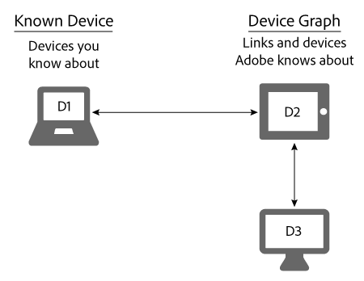

# 알려진 장치{#known-devices}

Device Graph의 알려진 장치 정보.

Device Graph에서 우리는 다음과 같은 개념을 가지고 있다. *`known device`*. 알려진 장치는 고객이 브랜드와 상호 작용하기 위해 사용하는 장치입니다.

>[!NOTE]
>
>다음에서 [!DNL Adobe Experience Cloud Device Co-op], 용어(예: *`device`*, *`person`*, *`identity`* 등 특별한 의미를 갖습니다. 예를 들어 &quot;장치&quot;는 전화기나 태블릿과 같은 물리적 하드웨어와 해당 하드웨어에서 실행되는 애플리케이션을 의미할 수 있습니다. 다음을 참조하십시오. [용어 설명](../glossary.md#glossgroup-0f47d7fbd76c4759801f565f341a386c) 을 참조하십시오.

## 알려진 장치로 목표 지원 {#section-80deae33660e4280ac65c659ceff5601}

알려진 장치 개념은 효과적 장치의 생성 및 유지에 필수적인 몇 가지 목표를 지원한다 [!DNL Device Co-op] 프로그램. 알려진 디바이스는 [!DNL Device Co-op] 구성원은 고객과의 몇 가지 상호 작용(예: 사이트 방문 또는 모바일 앱 사용)에서 이에 대해 알고 있습니다. 이러한 작업을 기반으로 [!DNL Device Graph] 의 알려진 장치를 연결합니다. [!DNL Device Co-op] 다른 사용자가 기여한 장치에 대한 멤버 [!DNL Device Co-op] 멤버. 이러한 링크는 다음과 같을 수 있습니다. [결정론적 또는 확률론적](../processes/links.md#concept-58bb7ab25f904f5f98d645e35205c931). 이 기능은 다음과 같습니다 [!DNL Device Co-op] 다음과 같은 메시지가 표시되기 때문에 구성원:

* 알려진 장치에 대한 추가 데이터입니다.
* 다른 연결된 장치에 대한 새로운 정보입니다.

다음 [!DNL Device Graph] 는 Device Co-op 구성원이 보지 않은 장치 클러스터에 대한 정보를 제공하지 않습니다.

## Device Co-op 목표 {#section-75aea5a102d54733aae2a7c6ee9ec6c7}

세 가지 주요 목표는 다음과 같은 요소에 애니메이션을 적용합니다. [!DNL Device Co-op]. 다음과 같은 보고서가 포함됩니다.

* **크기 조절:** 다양한 사용 사례에서 가능한 최대 링크 수를 공유합니다.
* **공정성:** 의 각 멤버가 [!DNL Device Co-op] 그들의 기여에 상응하는 방식으로 복리후생.

* **소비자 신뢰:** 소비자 교차 장치 경험에 이미 알고 있고 신뢰할 수 있는 브랜드가 포함되어 있는지 확인하여 소비자 신뢰를 유지 및 구축합니다.

## 크기 조절 및 알려진 장치 {#section-67f734109762457ca62ec306284ea082}

다음 방법은 장치가 알려진 장치로 적합해지는 보다 일반적인 방법입니다. 이러한 방법을 고려할 때, [!DNL Device Co-op] 구성원은 거의 항상 최소 1개의 알려진 장치를 보유합니다. 이는 의 모든 멤버에 최대 확장을 제공한다는 목표를 지원합니다. [!DNL Device Co-op].

**유기**

* 고객이 사이트를 방문하거나 앱을 사용하여. 자사 데이터를 기반으로 한 자격 조건입니다.
* CRM 시스템에서 온보딩하여 고객

**Marketplace를**

* Audience Marketplace에서 세그먼트 데이터 구매.
* 타사 데이터 공급자로부터 데이터를 구매하는 경우.

**Advertising**

경매에서 인벤토리를 낙찰하고 광고를 장치에 제공함으로써. 해당 광고에 이 포함된 경우 장치는 알려진 장치가 됩니다. [!DNL Audience Manager] 픽셀.

## 알려진 장치 및 공정성 사용 사례 {#section-0543188729d845d6b95db70b8b25e9f8}

의 멤버 [!DNL Device Co-op] 에 대한 기여도에 상응하는 링크 받기 [!DNL Device Graph]. 에 많은 장치를 제공하는 회사 [!DNL Device Graph] 몇 개만 기여하는 구성원보다 더 많은 링크를 받습니다. We believe믿다 this help make the [!DNL Device Co-op] 모든 구성원에게 공평합니다. 아래에 설명된 크고 작은 사용 사례에서 이것이 어떻게 작동하는지 살펴보겠습니다.

**브랜드 A: 대규모 사용 사례**

이 예에서 브랜드 A는 매달 100명의 사이트 방문자를 확보하고 새로운 교차 장치 브랜드 캠페인을 시작합니다. 간결성을 위해 다음을 가정해 보십시오. [!DNL Device Graph] 브랜드 A의 모든 방문자가 1개의 추가 장치에 연결되어 있다는 것을 알고 있습니다. 이는 브랜드 A가 다른 100개의 디바이스에 도달할 수 있음을 의미합니다. 또한 [!DNL Device Graph] 에는 함께 연결된 약 200개의 장치가 포함되어 있습니다.

<table id="table_78C38DC522F94BC38C1DB73740C058AC"> 
 <thead> 
  <tr> 
   <th colname="col1" class="entry"> 알려진 장치/월 </th> 
   <th colname="col2" class="entry"> Device Co-op에서 연결된 장치 받음 </th> 
   <th colname="col3" class="entry"> Campaign에 대한 총 장치 수 </th> 
  </tr>
 </thead>
 <tbody> 
  <tr> 
   <td colname="col1"> 
100 
 </td> 
   <td colname="col2"> 
100 
 </td> 
   <td colname="col3"> 
200 
 </td> 
  </tr> 
 </tbody> 
</table>

**브랜드 B: 소규모 사용 사례**

이 예에서 브랜드 B는 매달 100명의 사이트 방문자를 가지고 있으며 새로운 크로스 디바이스인 브랜드 캠페인을 시작합니다. 간결성을 위해 다음을 가정해 보십시오. [!DNL Device Graph] 브랜드 B의 모든 방문자가 50개의 추가 장치에 연결되어 있다는 것을 알고 있습니다. 이는 브랜드 B가 150개의 디바이스에 도달할 수 있음을 의미합니다. 또한 [!DNL Device Graph] 에는 함께 연결된 약 1,000개의 장치가 포함되어 있습니다.

<table id="table_A6C9CCF9C6564A89BA7060E075A8E73C"> 
 <thead> 
  <tr> 
   <th colname="col1" class="entry"> 알려진 장치/월 </th> 
   <th colname="col2" class="entry"> Device Co-op에서 연결된 장치 받음 </th> 
   <th colname="col3" class="entry"> Campaign에 대한 총 장치 수 </th> 
  </tr>
 </thead>
 <tbody> 
  <tr> 
   <td colname="col1"> 
100 
 </td> 
   <td colname="col2"> 
50 
 </td> 
   <td colname="col3"> 
150 
 </td> 
  </tr> 
 </tbody> 
</table>

>[!MORELIKETHIS]
>
>* [알 수 없는 장치](../processes/unknown-device.md#concept-95090d341cdc4c22ba4319d79d8f6e40)

