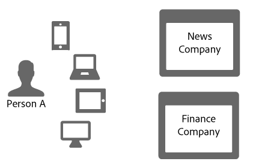
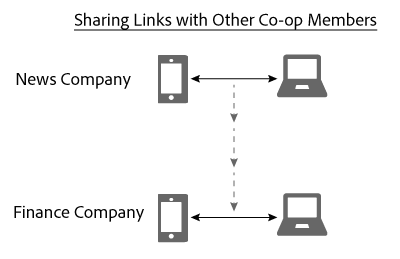

# 장치 그래프의 링크 공유{#link-sharing-in-the-device-graph}

장치 그래프의 링크 공유 정보.

이 [!DNL Device Graph] 는 결정적이고 확률적인 링크를 Adobe Experience Cloud 장치 조합의 다른 멤버들과 공유합니다. 링크 공유는 강력한 [!DNL Device Co-op] 기능입니다. 이 버전은 익명 사용자와 관련된 장치에 대해 각 구성원이 알고 있는 정보를 확장하지만 이전에 해당 익명 사용자의 장치 중 적어도 하나를 본 적이 있는 경우에만 적용됩니다.

## 장치 그래프 요약 검토 {#section-7858e9f61b5644c981ffb53626fcc19d}

시작하기 전에 잠시 시간을 내어 [!DNL Device Graph] 작동 방식을 살펴봅시다. 데이터 [!DNL Device Co-op] 멤버는 로 데이터를 보냅니다 [!DNL Device Graph]. 이 [!DNL Device Graph] 데이터는 장치 간의 [결정적 링크와 확률적 링크에서 개인의 신원을](../processes/links.md#concept-58bb7ab25f904f5f98d645e35205c931) 형성하기 위해 사용합니다. 이러한 링크는 [!DNL Device Co-op] 참가자로서 인증된 사용자, 다른 사용자 및 해당 장치 간의 관계에 대한 통찰력을 제공합니다. 아래 섹션에서 이 기능이 어떻게 작동하는지 살펴보겠습니다.

## 링크 공유 예 {#section-cb410d827cf14f76bc9b0bd4d31ed767}

다음 예는 장치 Co-op에서 링크 공유의 성능을 보여줍니다. 이 예에서는 News Company와 Finance Company라는 2개의 가상 회사가 있습니다. 두 회사는 모두 회원이다 [!DNL Device Co-op]. Person A는 여러 장치에서 각 회사의 웹 사이트를 로그온하거나 탐색하는 소비자입니다.

뉴스A가 스마트폰과 태블릿PC로 이 사이트에 인증을 받았기 때문에 이 ID로 식별한다. 이 ID는 암호화 해시로 해당 ID를 [!DNL Device Graph] 전송합니다. 파이낸스 회사는 이전에 이러한 장치를 보았지만, A라는 사람이 사이트에 로그온하지 않았습니다. 따라서, 파이낸스 회사는 이러한 장치가 상호 연관되어 있는지, 어떻게 관련되는지 또는 개인 A와 어떻게 연관되어 있는지 알지 못한다.

소비자 ID의 암호화 해시가 제공되면, 이 장치는 서로 연관성이 있고 특정 사람과도 관련이 있음을 [!DNL Device Graph] 인식합니다. 이러한 사이트 방문 [!DNL Device Co-op] 에 참여하지 않는 회사는 별도의 임의 장치에서 나온 것으로 나타납니다. 어떤 경우든, 일단 해시된 ID가 [!DNL Device Graph] 있으면,

* 휴대폰과 노트북이 연결되어 있는지 확인합니다.
* 파이낸스 회사가 휴대폰과 노트북이 연결되어 있는지 알고 싶어한다는 것을 인식합니다.

이런 상황에서 [!DNL Device Graph] 이제 해당 통신사는 뉴스 회사의 이러한 장치를 연결하는 링크를 파이낸스와 공유합니다. 이 프로세스 동안 [!DNL Device Graph] Co-op 멤버 간에 링크를 복제하고 공유합니다.

이때, 그 [!DNL Device Graph] 는 성공적으로 그 역할을 수행했다. 뉴스 회사와 파이낸스 회사는 모두 신원을 명확히 보여준다. 모든 장치에서 사람 A에 정확하게 도달할 수 있습니다.

## 개인 정보 및 링크 공유 {#section-7b566018b3304420a4b3e4c079826110}

회원의 개인 정보 및 데이터 무결성을 유지하는 것은 링크 공유 프로세스 전반에서 매우 중요합니다. [!DNL Device Co-op] 이 고객 ID 및 링크 공유 프로세스 동안 다음을 수행하지 [!DNL Device Graph] 않았습니다.

* 그 링크가 뉴스 회사로부터 왔다고 파이낸스 회사에 전하세요.
* 한 구성원이 사용하는 고객 ID를 다른 [!DNL Device Co-op] 멤버와 공유합니다.
* 모바일 장치 및 랩톱이 공유하는 링크 이외의 정보를 제공합니다.

## 다음 단계 {#section-ac6e61f1eb6e45b1bb4be8ece39147c7}

ID, 연결 및 링크 공유에 대한 설명서를 읽으면 데이터를 내부적으로 수집하는 방법에 대해 [!DNL Device Graph] 잘 이해할 수 있습니다. 다음 단계로, Device Co-op 구성원에 대한 장치 간 링크 *`known device`* 를 전달하는 방법을 설명하는 설명서를 살펴보는 것이 좋습니다. 알려진 [장치](../processes/known-device.md#concept-8e87c276819a48bfac5cef10b45216d1) 및 [알 수 없는 장치를 참조하십시오](../processes/unknown-device.md#concept-95090d341cdc4c22ba4319d79d8f6e40).
