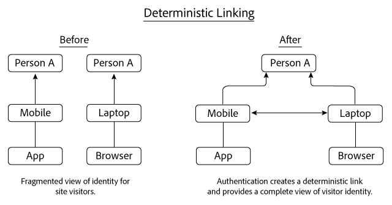
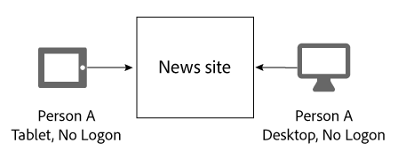
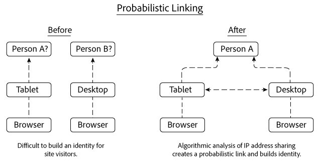
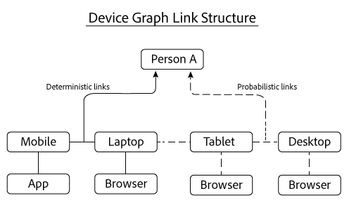

# Deterministic and probabilistic links{#deterministic-and-probabilistic-links}

Device Graph가 결정적 데이터와 확률적 데이터를 분석하여 장치를 함께 연결하는 맵을 만드는 방법입니다.

[!DNL Device Graph]의 내부 프로세스에서는 장치를 익명의 개별 사용자에게 매핑하고 연결하는 ID 계층을 만듭니다. 그래프 출력에는 일부 Experience Cloud 솔루션에 노출된 데이터와 함께 타깃팅에 사용할 수 있는 크로스 디바이스 링크가 포함되어 있습니다. The Adobe solutions that work with [!DNL Device Graph] data include Analytics, Audience Manager, Media Optimizer, and Target.

[!DNL Device Graph]는 결정적 데이터와 확률적 데이터를 분석하여 장치를 함께 연결하는 맵을 만듭니다. 결정적 데이터는 해시된 로그온 정보를 기반으로 장치를 연결합니다. 확률적 데이터는 IP 주소와 기타 메타데이터 등의 정보를 기반으로 장치를 연결합니다. [!DNL Device Graph]는 연결된 장치 클러스터를 익명의 개별 사용자에게 연결하고, 디지털 마케터는 이러한 연결을 통해 장치가 아닌 사람에게 도달할 수 있습니다. [!DNL Device Graph]에서 장치 소유자는 현실 사용자의 익명 표현입니다. 결정적 링크와 확률적 링크는 사용자 ID 구조를 만드는 데 도움이 됩니다.

>[!NOTE]
>
>Adobe Experience Cloud Device Co-op에서 *장치*, *사용자*&#x200B;및 *ID와* 같은 용어는 특별한 의미를 가집니다. For example, *device* can refer to physical hardware such as a phone or tablet and the applications that run on that hardware. 이에 대한 정의는 [용어집](../glossary.md#glossgroup-0f47d7fbd76c4759801f565f341a386c)을 참조하십시오.

## What are links? {#section-2df4c6f01eba49369993146df0661f13}

링크에 대해 이야기할 때는 링크가 [!DNL Experience Cloud] Device Graph의 컨텍스트에서 갖는 의미를 명심하는 것이 중요합니다. 이 컨텍스트에서 링크는 장치 간의 물리적 연결이 아닙니다. 대신, 링크는 Device Graph가 서로 다른 장치들을 알려지지 않은 동일한 사람에게 연결하는 방식입니다. 예를 들어 휴대폰과 데스크탑 브라우저가 있다고 가정할 경우, Device Graph가 이 장치들이 모두 알려지지 않은 동일한 사람에 의해 사용된다는 사실을 알게 되면 휴대폰과 브라우저는 &quot;연결된&quot; 것으로 간주될 수 있습니다. 아래에 설명된 것처럼, Device Graph는 결정적 링크와 확률적 링크로 ID를 만듭니다. 그리고 Device Graph에서 장치 소유자는 실제 사람에 대한 익명의 표현입니다.

## Deterministic links {#section-33d41e828a674b398e36fe63da20ac09}

결정적 링크는 장치를 인증 이벤트(예: 장치에서 사이트에 로그인하는 작업)를 기반으로 개인에게 연결합니다. 이 작업을 통해 소비자 ID로 알려진 익명화된 식별자가 생성됩니다. 결정적 링크 연결이 작동하는 방식을 살펴보겠습니다. 이 예에서 사람 A는 모바일 장치에서 앱을 통해 뉴스 사이트에 로그인합니다. 그날 나중에 사람 A가 다시 로그인하지만, 이번에는 랩톱에 있는 브라우저에서 로그인합니다.

로그온 정보를 기반으로 Device Graph는 다음을 수행합니다.

* 사람 A가 휴대폰/앱 및 랩톱/브라우저 장치 조합으로 뉴스 사이트에 인증했음을 파악합니다.
* 이 장치들을 사람 A에 연결합니다.
* 익명의 사람과 연결된 장치를 기반으로 ID를 만듭니다.

>[!NOTE]
>
>Neither the [!DNL Adobe Experience Cloud Device Co-op] or the [!DNL Device Graph] receives actual authentication information or personally identifiable information (PII) in this data. Members of the [!DNL Experience Cloud Device Co-op], pass in cryptographically hashed, unique consumer IDs to the Device Graph. 소비자 ID는 Device Graph에서 인증된 사용자를 나타내며 소비자의 개인 정보를 보호합니다.

## Probabilistic links {#section-5f5aa755da984f9d851f7cb380262998}

확률적 링크는 다음과 같은 특성과 메타데이터를 기반으로 알고리즘 방식을 사용하여 장치를 사람에게 연결합니다.

* 탐색 행동
* IP 주소
* 운영 체제
* IDFA 및 GAID 식별자

확률적 링크 연결이 작동하는 방식을 살펴보겠습니다. 이 예에서 사람 A는 태블릿에서 뉴스 사이트를 탐색한 다음 나중에 데스크탑 컴퓨터에서 해당 사이트를 탐색합니다. 탐색하는 동안 사람 A는 뉴스 사이트에 로그온하지 않습니다. 이러한 별도의 방문이 이루어지는 동안 태블릿과 데스크탑은 동일한 IP 주소를 공유합니다.

이 정보를 기반으로 [!DNL Device Graph]는 두 장치 간의 IP 주소 공유 패턴을 평가하고 그 결과 이러한 장치가 사람 A의 것으로 판단되면 이 장치들을 함께 연결합니다. 최종 결과는 알고리즘 방식의 확률적 계산으로 유추된 ID 계층입니다.

이 예에서 Device Graph는 두 장치가 동일한 뉴스 사이트에 액세스하는 데 사용된 후 이 두 장치를 모두 연결했습니다. 하지만 장치가 서로 연결되기 위해서 동일한 사이트에 나타나야 하는 것은 아닙니다. 이를 설명하기 위해, 이 예의 각 장치가 완전히 서로 다른 웹 사이트를 방문한다고 가정하겠습니다. [!DNL Device Graph] 알고리즘은 여전히 공유되고 있는 IP 주소를 기반으로, 다른 데이터에 대한 분석을 통해 확률적 링크를 만들 수 있습니다. 이 프로세스는 [!DNL Experience Cloud] Device Co-op의 구성원을 위해 확률적 링크 연결을 매우 강력하게 만드는 데 유용한 프로세스입니다.

## Both types of data provide value {#section-43d22d8c10634edcb261e7bda6fdf323}

결정적 데이터와 확률적 데이터는 서로 보완적입니다. 그에 반해, 결정적 데이터만 포함하는 Device Graph에서는 사람의 ID가 제한적으로 표시됩니다. 인증이 없을 경우 Device Graph는 사이트를 탐색하는 다른 장치와 사람에 대해 알려줄 수 없습니다. 확률적 데이터는 이러한 연결을 만들고 인증되지 않은 장치, 사람 및 가정에 도달하는 데 도움이 될 수 있습니다.

하지만 결정적 데이터도 중요합니다. 예를 들어 결정적 데이터는 확률적 신호가 풍부하고 중복되는 곳(예: 커피숍, 도서관, 공항 등)에서 생성된 가짜 링크를 제거하여 확률적 의사 결정을 개선할 수 있습니다.

두 유형의 데이터를 모두 사용하는 경우 어느 한 쪽 유형만 사용할 때보다 Device Graph에서 사람의 ID에 대해 보다 종합적인 그림을 제공합니다.

